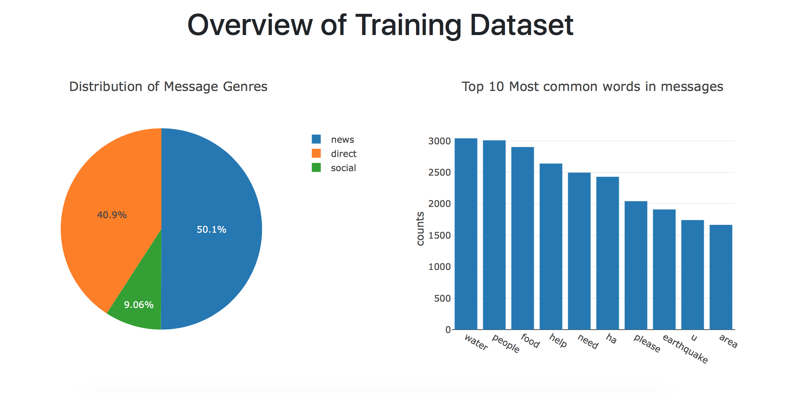
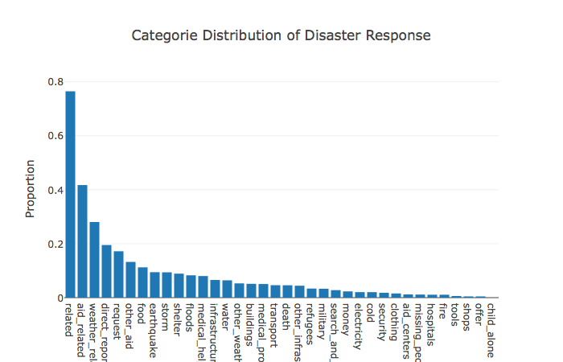
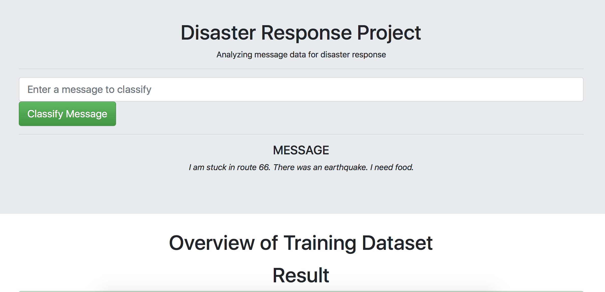
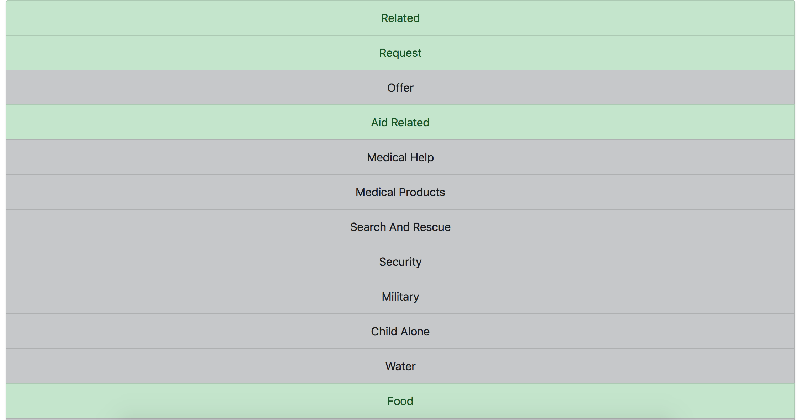
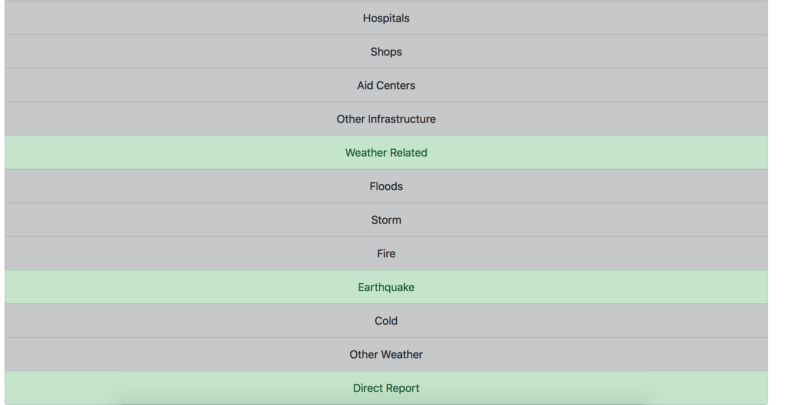

# Disaster Response Pipeline Project

1. [Project Overview.](#proj)
2. [Installation.](#inst)
3. [File Descriptions.](#file)
4. [Results.](#res)
5. [Licensing, Authors, and Acknowledgements.](#ac)

<a name="proj"></a>
## 1. Project Overview

This project analyzes large dataset from past disasters and uses machine learning to plan for disaster response. The results are delivered via a Flask web app. 

The project includes three components:

1. **ETL Pipeline:** The first part of the data pipeline is the ETL(Extract, Transform, and Load) process. Here, the dataset is read, cleaned, and then stored in a SQLite database. 

2. **Machine Learning Pipeline:** The machine learning pipeline uses NLTK, scikit-learn's Pipeline and GridSearchCV to output a final model that uses the message column to predict classifications for 36 categories (multi-output classification). And then the model is exported to a pickle file.

3. **Flask App**: The results are visulized and displayed in a Flask web app.


<a name="inst"></a>
## 2. Installation

Python 3.7.2 


### Instructions:
1. Run the following commands in the project's root directory to set up database and model.

    - To run ETL pipeline that cleans data and stores in database
        `python data/process_data.py data/disaster_messages.csv data/disaster_categories.csv data/DisasterResponse.db`
    - To run ML pipeline that trains classifier and saves
        `python models/train_classifier.py data/DisasterResponse.db models/classifier.pkl`

2. Run the following command in the app's directory to run web app.
    `python run.py`

3. Go to http://0.0.0.0:3001/

<a name="file"></a>
## 3. File Description
```bash
├── app         
│   ├── templates                         
│   │   ├── master.html                  # master html page 
│   │   ├── go.html                      # master/go html page that displays the search bar result
|   ├── visual.py                        # Use plotly to make visualization
│   └── run.py                           # Deploy visulazation via Flask web app
├── data
│   ├── disaster_messages.csv            # Dataset containing original messages
│   ├── disaster_categories.csv          # Dataset encoded with 36 different categories related to disaster response
│   ├── process.py                       # ETL pipeline
│   └── DisasterResponse.db              # cleaned dataset stored in SQLite database 
└── models
    └── train_classifier.py              # Machine learning pipeline
```

<a name="res"></a>
## 4. Results

The machine learning model evaluation results are show in the table below

**Flask web app screenshot**






**Accuracy Table**
```
Accuracy:
related                   0.819823
request                   0.891663
offer                     0.995390
aid_related               0.784095
medical_help              0.926047
medical_products          0.953515
search_and_rescue         0.973876
security                  0.979831
military                  0.967153
child_alone               1.000000
water                     0.959470
food                      0.943527
shelter                   0.940837
clothing                  0.984825
money                     0.976950
missing_people            0.992509
refugees                  0.966193
death                     0.965040
other_aid                 0.865156
infrastructure_related    0.932578
transport                 0.956781
buildings                 0.954091
electricity               0.979831
tools                     0.992509
hospitals                 0.988283
shops                     0.994622
aid_centers               0.989243
other_infrastructure      0.954284
weather_related           0.883212
floods                    0.951018
storm                     0.942374
fire                      0.990588
earthquake                0.974260
cold                      0.978871
other_weather             0.948521
direct_report             0.847292
```

```
                       related
              precision    recall  f1-score   support

           0       0.70      0.39      0.50      1214
           1       0.84      0.95      0.89      3992

    accuracy                           0.82      5206
   macro avg       0.77      0.67      0.70      5206
weighted avg       0.81      0.82      0.80      5206

request
              precision    recall  f1-score   support

           0       0.90      0.98      0.94      4293
           1       0.82      0.49      0.62       913

    accuracy                           0.89      5206
   macro avg       0.86      0.73      0.78      5206
weighted avg       0.89      0.89      0.88      5206

offer
              precision    recall  f1-score   support

           0       1.00      1.00      1.00      5182
           1       0.00      0.00      0.00        24

    accuracy                           1.00      5206
   macro avg       0.50      0.50      0.50      5206
weighted avg       0.99      1.00      0.99      5206

aid_related
              precision    recall  f1-score   support

           0       0.80      0.85      0.82      3045
           1       0.77      0.70      0.73      2161

    accuracy                           0.79      5206
   macro avg       0.78      0.78      0.78      5206
weighted avg       0.79      0.79      0.79      5206

medical_help
              precision    recall  f1-score   support

           0       0.93      1.00      0.96      4803
           1       0.69      0.09      0.16       403

    accuracy                           0.93      5206
   macro avg       0.81      0.54      0.56      5206
weighted avg       0.91      0.93      0.90      5206

medical_products
              precision    recall  f1-score   support

           0       0.95      1.00      0.98      4955
           1       0.82      0.06      0.10       251

    accuracy                           0.95      5206
   macro avg       0.89      0.53      0.54      5206
weighted avg       0.95      0.95      0.93      5206

search_and_rescue
              precision    recall  f1-score   support

           0       0.97      1.00      0.99      5065
           1       0.71      0.07      0.13       141

    accuracy                           0.97      5206
   macro avg       0.84      0.54      0.56      5206
weighted avg       0.97      0.97      0.96      5206

security
              precision    recall  f1-score   support

           0       0.98      1.00      0.99      5102
           1       0.00      0.00      0.00       104

    accuracy                           0.98      5206
   macro avg       0.49      0.50      0.49      5206
weighted avg       0.96      0.98      0.97      5206

military
              precision    recall  f1-score   support

           0       0.97      1.00      0.98      5028
           1       0.78      0.04      0.07       178

    accuracy                           0.97      5206
   macro avg       0.87      0.52      0.53      5206
weighted avg       0.96      0.97      0.95      5206

child_alone
              precision    recall  f1-score   support

           0       1.00      1.00      1.00      5206

    accuracy                           1.00      5206
   macro avg       1.00      1.00      1.00      5206
weighted avg       1.00      1.00      1.00      5206

water
              precision    recall  f1-score   support

           0       0.96      1.00      0.98      4898
           1       0.85      0.37      0.51       308

    accuracy                           0.96      5206
   macro avg       0.91      0.68      0.75      5206
weighted avg       0.95      0.96      0.95      5206

food
              precision    recall  f1-score   support

           0       0.95      0.99      0.97      4627
           1       0.85      0.62      0.71       579

    accuracy                           0.95      5206
   macro avg       0.90      0.80      0.84      5206
weighted avg       0.94      0.95      0.94      5206

shelter
              precision    recall  f1-score   support

           0       0.94      1.00      0.97      4754
           1       0.88      0.37      0.52       452

    accuracy                           0.94      5206
   macro avg       0.91      0.68      0.75      5206
weighted avg       0.94      0.94      0.93      5206

clothing
              precision    recall  f1-score   support

           0       0.99      1.00      0.99      5125
           1       0.71      0.06      0.11        81

    accuracy                           0.99      5206
   macro avg       0.85      0.53      0.55      5206
weighted avg       0.98      0.99      0.98      5206

money
              precision    recall  f1-score   support

           0       0.98      1.00      0.99      5083
           1       1.00      0.02      0.05       123

    accuracy                           0.98      5206
   macro avg       0.99      0.51      0.52      5206
weighted avg       0.98      0.98      0.97      5206

missing_people
              precision    recall  f1-score   support

           0       0.99      1.00      1.00      5166
           1       1.00      0.03      0.05        40

    accuracy                           0.99      5206
   macro avg       1.00      0.51      0.52      5206
weighted avg       0.99      0.99      0.99      5206

refugees
              precision    recall  f1-score   support

           0       0.97      1.00      0.98      5030
           1       0.00      0.00      0.00       176

    accuracy                           0.97      5206
   macro avg       0.48      0.50      0.49      5206
weighted avg       0.93      0.97      0.95      5206

death
              precision    recall  f1-score   support

           0       0.97      1.00      0.98      4982
           1       0.83      0.22      0.35       224

    accuracy                           0.96      5206
   macro avg       0.90      0.61      0.66      5206
weighted avg       0.96      0.96      0.95      5206

other_aid
              precision    recall  f1-score   support

           0       0.87      1.00      0.93      4496
           1       0.62      0.03      0.05       710

    accuracy                           0.87      5206
   macro avg       0.75      0.51      0.49      5206
weighted avg       0.83      0.87      0.81      5206

infrastructure_related
              precision    recall  f1-score   support

           0       0.93      1.00      0.97      4858
           1       0.40      0.01      0.01       348

    accuracy                           0.93      5206
   macro avg       0.67      0.50      0.49      5206
weighted avg       0.90      0.93      0.90      5206

transport
              precision    recall  f1-score   support

           0       0.96      1.00      0.98      4961
           1       0.77      0.14      0.24       245

    accuracy                           0.96      5206
   macro avg       0.87      0.57      0.61      5206
weighted avg       0.95      0.96      0.94      5206

buildings
              precision    recall  f1-score   support

           0       0.96      1.00      0.98      4944
           1       0.79      0.15      0.25       262

    accuracy                           0.96      5206
   macro avg       0.87      0.57      0.61      5206
weighted avg       0.95      0.96      0.94      5206

electricity
              precision    recall  f1-score   support

           0       0.98      1.00      0.99      5096
           1       1.00      0.05      0.10       110

    accuracy                           0.98      5206
   macro avg       0.99      0.53      0.55      5206
weighted avg       0.98      0.98      0.97      5206

tools
              precision    recall  f1-score   support

           0       0.99      1.00      1.00      5167
           1       0.00      0.00      0.00        39

    accuracy                           0.99      5206
   macro avg       0.50      0.50      0.50      5206
weighted avg       0.99      0.99      0.99      5206

hospitals
              precision    recall  f1-score   support

           0       0.99      1.00      0.99      5145
           1       0.00      0.00      0.00        61

    accuracy                           0.99      5206
   macro avg       0.49      0.50      0.50      5206
weighted avg       0.98      0.99      0.98      5206

shops
              precision    recall  f1-score   support

           0       0.99      1.00      1.00      5178
           1       0.00      0.00      0.00        28

    accuracy                           0.99      5206
   macro avg       0.50      0.50      0.50      5206
weighted avg       0.99      0.99      0.99      5206

aid_centers
              precision    recall  f1-score   support

           0       0.99      1.00      0.99      5150
           1       0.00      0.00      0.00        56

    accuracy                           0.99      5206
   macro avg       0.49      0.50      0.50      5206
weighted avg       0.98      0.99      0.98      5206

other_infrastructure
              precision    recall  f1-score   support

           0       0.95      1.00      0.98      4971
           1       0.00      0.00      0.00       235

    accuracy                           0.95      5206
   macro avg       0.48      0.50      0.49      5206
weighted avg       0.91      0.95      0.93      5206

weather_related
              precision    recall  f1-score   support

           0       0.89      0.96      0.92      3732
           1       0.86      0.70      0.77      1474

    accuracy                           0.88      5206
   macro avg       0.87      0.83      0.85      5206
weighted avg       0.88      0.88      0.88      5206

floods
              precision    recall  f1-score   support

           0       0.95      1.00      0.97      4784
           1       0.89      0.44      0.59       422

    accuracy                           0.95      5206
   macro avg       0.92      0.72      0.78      5206
weighted avg       0.95      0.95      0.94      5206

storm
              precision    recall  f1-score   support

           0       0.95      0.99      0.97      4700
           1       0.82      0.54      0.65       506

    accuracy                           0.94      5206
   macro avg       0.89      0.76      0.81      5206
weighted avg       0.94      0.94      0.94      5206

fire
              precision    recall  f1-score   support

           0       0.99      1.00      1.00      5157
           1       0.00      0.00      0.00        49

    accuracy                           0.99      5206
   macro avg       0.50      0.50      0.50      5206
weighted avg       0.98      0.99      0.99      5206

earthquake
              precision    recall  f1-score   support

           0       0.98      0.99      0.99      4730
           1       0.89      0.80      0.84       476

    accuracy                           0.97      5206
   macro avg       0.93      0.90      0.91      5206
weighted avg       0.97      0.97      0.97      5206

cold
              precision    recall  f1-score   support

           0       0.98      1.00      0.99      5091
           1       0.75      0.05      0.10       115

    accuracy                           0.98      5206
   macro avg       0.86      0.53      0.54      5206
weighted avg       0.97      0.98      0.97      5206

other_weather
              precision    recall  f1-score   support

           0       0.95      1.00      0.97      4934
           1       0.86      0.02      0.04       272

    accuracy                           0.95      5206
   macro avg       0.90      0.51      0.51      5206
weighted avg       0.94      0.95      0.93      5206

direct_report
              precision    recall  f1-score   support

           0       0.86      0.97      0.91      4161
           1       0.76      0.38      0.51      1045

    accuracy                           0.85      5206
   macro avg       0.81      0.67      0.71      5206
weighted avg       0.84      0.85      0.83      5206


```

<a name="ac"></a>
## 5. Licensing, Authors, and Acknowledgements
Licensing: [MIT](https://choosealicense.com/licenses/mit/)
Acknowledgements: The dataset is from [Figure Eight](https://www.figure-eight.com/dataset/combined-disaster-response-data/). This project is adapted from Udacity's Data Science Nanodegree. 
